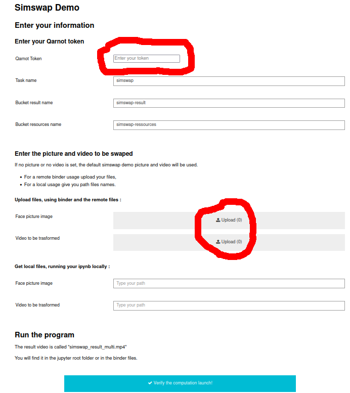
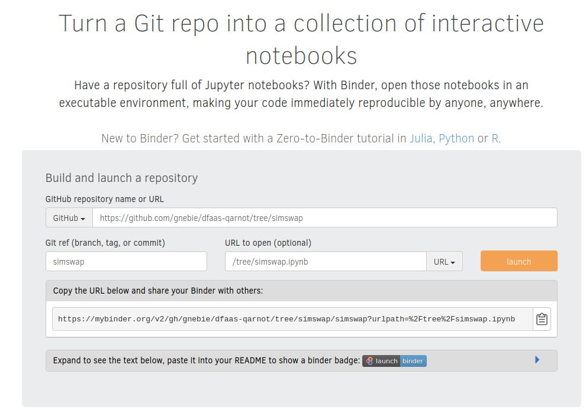

# Simswap Binder payload

Binder :   
[](https://mybinder.org/v2/gh/gnebie/dfaas-qarnot/simswap?urlpath=%2Ftree%2Fsimswap.ipynb)

This is an MVP for running Simswap, a DeepFake framework, on Qarnot through a jupyter notebook with minimal user intervention using a GUI based on jupyter widgets.


## Simswap :

[simswap github](https://github.com/neuralchen/SimSwap)

Version : 
* version 1.0

This is a complex deepfake library to change the face of a person in a video. 
The DeepLearning model is proposed as a demo by the simswap staff. 
The version used is the 1.0 version. (août 2021)

This project is for technical and academic use only. Please do not apply it to illegal and unethical scenarios.

### Content :

* `simswap.ipynb` : notebook with graphical interface to launch the task on Qarnot.
* `postBuild`: post build file specific to Binder, used to set the notebook as trusted on launch.
* `requirements.txt`: pip requirements file of python modules needed for the use case.


### Run Requirements:

* Your *Qarnot Token*
* A picture of face of the people you want to add
* The video with the face to be changed




Add the 3 requirements and click on the down button, verify your info and launch the task.
When it end, get the downloaded file called `simswap_result_multi.mp4` 


### How to run it Locally :
##### install the dependencies:
```bash
pip install requirements.txt
```
##### Run locally:
```bash
jupyter notebook simswap.ipynb
```

### How to run it remotely:

[Run it on binder](https://mybinder.org/v2/gh/gnebie/dfaas-qarnot/simswap?urlpath=%2Ftree%2Fsimswap.ipynb)


